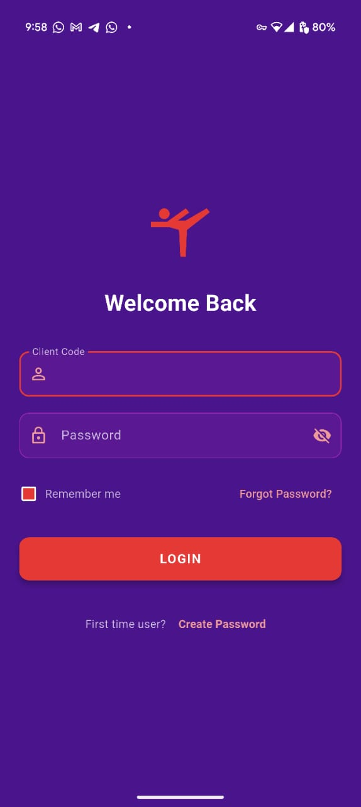
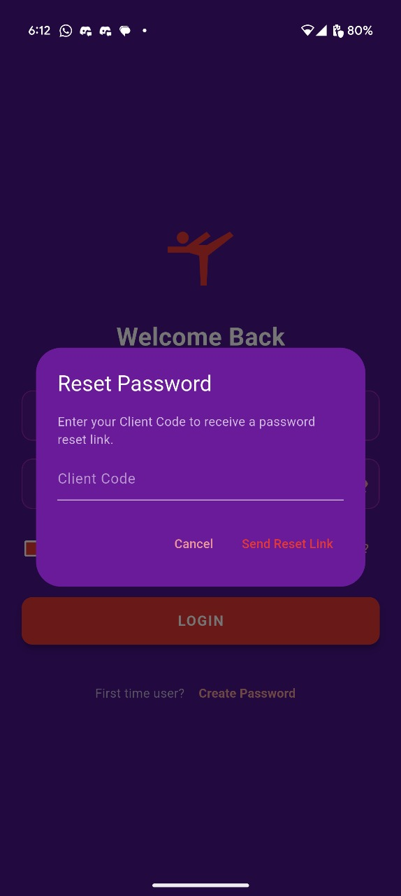
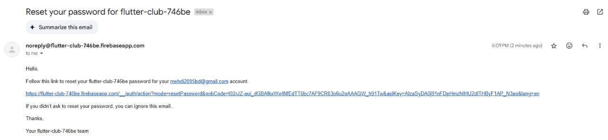
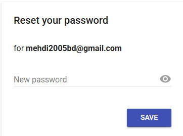
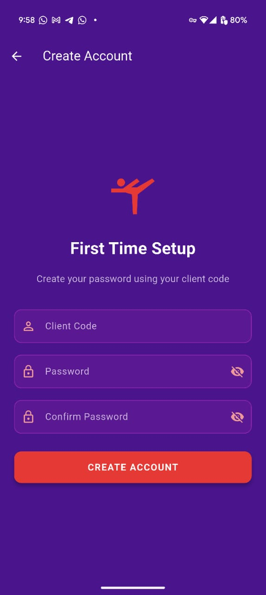
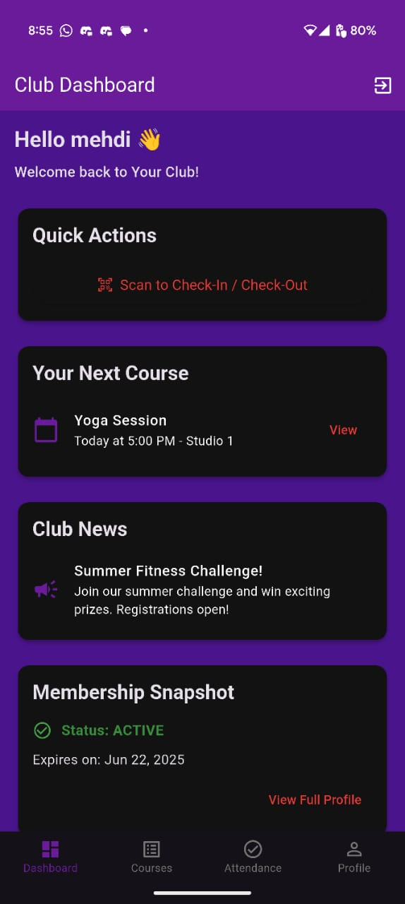
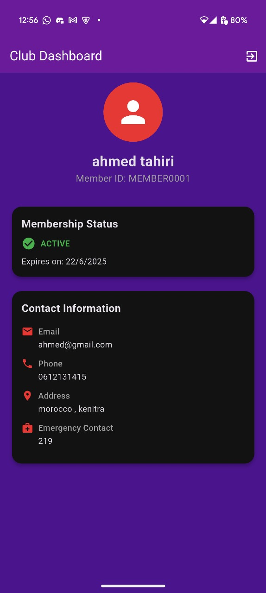
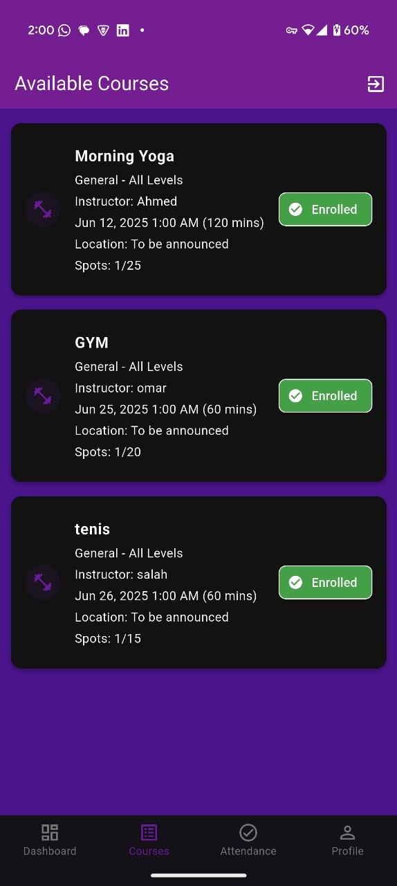

# 🏋️‍♂️ Sports Club Companion App

A powerful and modern Flutter-based mobile application built for sports clubs to enhance member engagement, streamline daily operations, and simplify course and reservation management.

---

## 📱 Overview

The **Sports Club Companion App** serves as a digital bridge between sports clubs and their members — replacing outdated, manual processes with a sleek, real-time mobile solution. Designed for convenience, control, and communication, it empowers members to manage their club experience from anywhere.

---

## ✨ Key Features

### 👤 Member Authentication & Management
- Secure login with client code and password
- Guided signup (password creation for pre-registered users)
- Forgot password flow
- Profile view and edit

### 🏃‍♂️ Course Management
- Browse fitness classes and sports activities
- Real-time course availability and enrollment
- View schedules, instructors, pricing, and difficulty

### 🗓 Reservation System
- Book slots for facilities or sessions
- Select preferred coaches
- Digital check-in system
- View upcoming reservations

### 💳 Subscription Management
- Track subscription status and expiry
- Access payment history
- Get notified of renewals

### 🔔 Notifications & Communication
- Push notifications for announcements and updates
- Daily status and activity information

### 📊 Attendance Tracking
- View past check-in records
- Track personal engagement over time

---

## 🧱 Technical Stack

| Layer            | Technology           |
|------------------|----------------------|
| **Frontend**     | Flutter (iOS & Android) |
| **Authentication** | Firebase Authentication |
| **Database**     | Firebase Cloud Firestore |
| **Push Notifications** | Firebase Cloud Messaging |
| **Access Control** | Firestore Security Rules |

---

## 🔒 Business Model Integration

- 👨‍💼 **Club-Centric Control:** All member data is managed by club staff.
- 💳 **Offline Payments:** Payments are handled at the club; app reflects the transaction history.
- 🗂 **Pre-Filled Accounts:** Members receive login credentials based on staff-entered records.

---

## 🎯 Target Users

- **Members:** Book classes, track subscriptions, and view attendance on the go.
- **Staff:** Manage member reservations and update class schedules with ease.
- **Club Management:** Monitor engagement and optimize resource planning.

---

## 🧩 System Architecture (UML)

## 📸 App Screenshots

> Add your screenshots to the `assets/screenshots/` directory and they'll appear below automatically.

  
    
  
  
  
  
  
  
  
  
  

